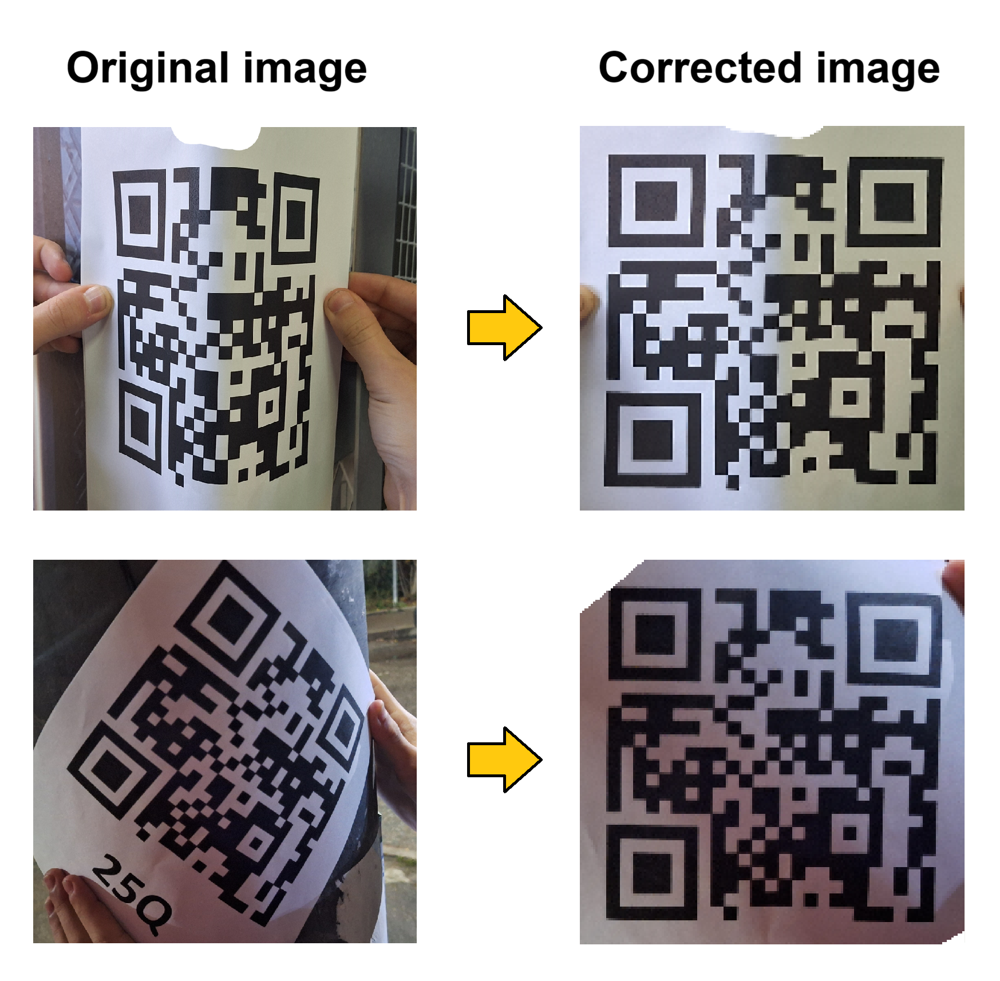

# CSQR-D — декодирование QR-кодов на криволинейных поверхностях

[English version](README.md)

Обнаружение и декодирование QR-кодов, размещённых на произвольных гладких неплоских поверхностях.

CSQR-D восстанавливает геометрию искривлённого QR-кода, выпрямляет изображение и затем использует обычное декодирование QR-кодов для извлечения данных.

На текущем наборе данных для бенчмарка реализация CSQR-D на C++ декодирует **163 из 169 изображений (96,45%)**. Подробные результаты и условия измерений приведены ниже.



## Что такое CSQR-D?

Большинство QR-декодеров рассчитано на изображения, в которых QR-код можно приблизительно описать плоским проективным преобразованием. Когда QR-код напечатан на искривлённой поверхности, например на цилиндре или другом гладком неплоском объекте, это предположение перестаёт работать: разные части кода могут искажаться по-разному.

CSQR-D предназначен специально для такого типа геометрической деформации. Вместо того чтобы пытаться заставить обычный декодер обработать искажённое изображение напрямую, он сначала восстанавливает геометрию QR-кода и строит приблизительно регулярное представление, которое может быть декодировано обычными QR-считывателями.

Текущая реализация предназначена для QR-кодов на **гладких искривлённых поверхностях**. Она не рассчитана в первую очередь на произвольные физические повреждения, разрывы или сильно негладкие деформации.

## Приложение

CSQR-D интегрирован в **Curved QR Scanner** — Android-приложение для практического сканирования QR-кодов. Приложение предоставляет удобный интерфейс с использованием камеры, а сканер CSQR-D помогает обрабатывать QR-коды, которые обычным сканерам трудно прочитать.

[Скачать Curved QR Scanner из GitHub Releases](https://github.com/Akula538/CSQR-D/releases)

## Бенчмарк

### Набор данных

Для оценки точности используются все **169 изображений со смартфонов** из `data`. Уровни деформации определяются по суффиксам `_d0`–`_d3` в именах файлов; уровни коррекции ошибок QR L, M, Q и H также закодированы в именах файлов.

- **0** — почти плоская поверхность (12 образцов)
- **1** — небольшая кривизна (53 образца)
- **2** — заметная кривизна (92 образца)
- **3** — сильная кривизна (12 образцов)

Для оценки точности изображения уменьшаются до **2000 пикселей по большей стороне** с сохранением пропорций (обычно 2000×924 или 924×2000; одно изображение — 965×2000). Все пять сканеров получают одинаковые уменьшенные изображения. Масштабирование выполняется Pillow LANCZOS; другая внешняя предобработка не применяется.

### Точность распознавания

Доля распознавания — это отношение числа изображений, для которых сканер возвращает непустые декодированные данные QR, к общему числу изображений. Результаты CSQR-D `None` и `CTF` считаются ошибками. Этот показатель измеряет успешность декодирования без сопоставления данных с независимой разметкой истинных значений.

| Деформация | Образцы | ZXing-C++ | ZBar / pyzbar | OpenCV | QReader | CSQR-D |
|---|---:|---:|---:|---:|---:|---:|
| 0 | 12 | 58,33% | 50,00% | 33,33% | 75,00% | 100,00% |
| 1 | 53 | 37,74% | 16,98% | 13,21% | 33,96% | 100,00% |
| 2 | 92 | 9,78% | 6,52% | 0,00% | 6,52% | 93,48% |
| 3 | 12 | 0,00% | 0,00% | 0,00% | 0,00% | 100,00% |
| **Всего** | 169 | 21,30% | 12,43% | 6,51% | 19,53% | 96,45% |

### Сравнение времени работы

Время работы измеряется на всех **135 PNG-изображениях (640×640)** из `data2` без масштабирования. Сопутствующий файл `labels.csv.gz` не является изображением и исключён. Каждый сканер выполняет один незамеряемый прогревочный запуск, за которым следуют **три измеряемых вызова на изображение** (405 измерений на сканер). Среднее, медиана и P95 вычисляются по всем вызовам, включая неудачные попытки декодирования; для P95 используется линейная интерполяция процентилей.

| Сканер | Среднее (мс) | Медиана (мс) | P95 (мс) |
|---|---:|---:|---:|
| ZXing-C++ | 8,70 | 8,55 | 11,27 |
| ZBar / pyzbar | 14,89 | 14,89 | 17,43 |
| OpenCV | 26,28 | 27,10 | 38,58 |
| QReader | 238,71 | 178,00 | 680,58 |
| CSQR-D | 39,55 | 34,47 | 78,73 |

Этот набор данных проще, чем набор с искривлёнными QR-кодами, но не каждый сканер декодирует его успешно. Число успешных результатов при первом измеряемом вызове для каждого изображения: ZXing-C++: 112/135, ZBar: 98/135, OpenCV: 54/135, QReader: 126/135, CSQR-D: 132/135.

### Время работы CSQR-D

Для этого бенчмарка используются все **169 изображений из `data`**, уменьшенные до **1000 пикселей по большей стороне** с сохранением пропорций. Каждая ячейка содержит **среднее время работы в миллисекундах**, включая успешные и неудачные попытки, для данной группы деформации / коррекции ошибок. После одного незамеряемого прогревочного запуска для каждого изображения выполняется один измеряемый вызов. **Масштабирование и сохранение уменьшенного изображения происходят до начала измерения и в него не включаются.**

| Деформация / EC | L | M | Q | H |
|---|---:|---:|---:|---:|
| 0 | 83,97 | 48,79 | 70,41 | 46,94 |
| 1 | 72,38 | 60,41 | 74,60 | 56,21 |
| 2 | 90,55 | 74,35 | 77,91 | 59,47 |
| 3 | 113,40 | 97,50 | 104,58 | 68,79 |

### Среда измерений и воспроизведение

Измерения выполнены в Windows 11 на **AMD Ryzen 7 6800HS with Radeon Graphics** с использованием Python 3.12.4. Все бенчмарки запускаются последовательно на CPU. Библиотеки для сравнения: zxing-cpp 3.1.1, pyzbar 0.1.9, opencv-python 5.0.0.93, qreader 3.16, qrdet 2.5, torch 2.14.1. Для масштабирования входных изображений использовался Pillow 10.3.0. QReader использует малую (`s`) модель и порог уверенности 0,5; загрузка, скачивание и инициализация модели исключены из времени измерения.

Для каждого бенчмарка CSQR-D использует существующий **C++ Release CLI** с `--seed 1`:

```powershell
.\src\cpp\build\bin\qrscanner_cli.exe <image-path> --seed 1
```

Для замера времени используется `perf_counter_ns`; в него входит чтение изображения. Время CSQR-D также включает запуск и завершение CLI-процесса; остальные сканеры используют Python-привязки в уже работающем процессе. Это время вызова указанных интерфейсов, а не изолированное время работы ядра декодера. Некоторые изображения из `data2` содержат несколько QR-кодов: CSQR-D возвращает одни декодированные данные, тогда как привязки для сравнения могут возвращать несколько. ZXing-C++ и ZBar ограничены QR-кодами; OpenCV использует `QRCodeDetector.detectAndDecodeMulti`. Сканеры сохраняют свою внутреннюю предобработку по умолчанию.

Для воспроизведения включены [скрипт бенчмарка](test/benchmark_readme.py), [зафиксированные требования](test/benchmark_requirements.txt), [поизображевые измерения](test/benchmark_results), [сводка](test/benchmark_results/summary.json) и [среда / хеш CLI](test/benchmark_results/environment.json). Из корня репозитория выполните:

```powershell
python -m pip install --target test/deps -r test/benchmark_requirements.txt
python test/benchmark_readme.py
python test/benchmark_readme.py --summarize --update-readme
```

Завершённые прогоны сканеров и наборов данных продолжаются из файлов JSONL; перед полностью новым измерением переместите эти файлы в другое место. Хеши входных файлов, размеры и метки групп записываются в [манифест набора данных](test/benchmark_results/manifest.json).

## Как это работает

CSQR-D организован как многоэтапный конвейер восстановления. Сначала он пытается выполнить обычное декодирование QR-кода и запускает более затратную геометрическую реконструкцию только при необходимости.

### 1. Начальное декодирование

Входное изображение сначала передаётся обычным QR-декодерам. Если QR-код уже читается, геометрическая реконструкция не требуется.

### 2. Обнаружение поисковых шаблонов

Когда стандартное декодирование не удаётся, CSQR-D ищет три поисковых шаблона QR-кода.

Детектор на основе контуров использует структуру вложенных контуров вместе с геометрическими ограничениями для выявления кандидатов в поисковые шаблоны и определения конфигурации трёх шаблонов. Это даёт геометрическую опору, необходимую для следующих этапов реконструкции.

### 3. Реконструкция геометрии QR-кода

Обнаруженные поисковые шаблоны используются для восстановления положения и ориентации сетки QR-кода. Для плоского QR-кода обычно достаточно перспективного преобразования. Однако на искривлённой поверхности деформация различается по всему коду, поэтому одного плоского преобразования недостаточно.

Поэтому CSQR-D восстанавливает дополнительную информацию о сетке QR-кода, включая распределение её внутренней структуры и, при наличии, шаблоны выравнивания.

### 4. Восстановление локальной деформации

Для сильно искривлённых или иным образом сложных образцов CSQR-D оценивает локальную деформацию QR-изображения по градиентам изображения.

Сначала производные Собеля используются для получения локальных направлений градиента. Затем изображение рассматривается в локальных областях, где доминирующие направления градиента оцениваются по пикам локального распределения ориентаций. Эти направления образуют векторное поле, описывающее локальную структуру искажённого QR-изображения.

Через это векторное поле проводятся интегральные кривые. Их пересечения формируют восстановленную сетку точек, соответствующих регулярной структуре QR-кода. Затем к этим точкам подбирается преобразование **Thin Plate Spline (TPS)**, которое используется для выпрямления изображения.

### 5. Окончательное декодирование

После геометрической коррекции восстановленное QR-изображение передаётся обычному QR-декодеру. Таким образом, назначение CSQR-D прежде всего — решить **задачу восстановления геометрии**, а стандартный декодер выполняет собственно декодирование символа QR.

## Ограничения

Сейчас CSQR-D лучше всего работает, когда:

- все три поисковых шаблона хорошо видны;
- модули QR-кода приблизительно квадратные, а не скруглённые;
- центральная часть QR-кода не имеет значительных перекрытий;
- фон не содержит сильных направленных текстур или линейных узоров;
- QR-код снят с достаточным разрешением;
- деформация является гладкой, а не произвольной или разрывной.

Текущая реализация не поддерживает надёжно несколько QR-кодов на одном изображении.

## Набор данных

Набор данных для бенчмарка доступен непосредственно в репозитории:

[**Набор данных CSQR-D**](https://github.com/Akula538/CSQR-D/tree/main/data)

## Использование и интеграция

Репозиторий содержит реализации CSQR-D на Python и C++, поэтому сканер также можно интегрировать в другие проекты.

- [Реализация на Python](src/python)
- [Реализация на C++](src/cpp)

Android-приложение предоставляется как практическая демонстрация сканера:

[**Релизы Curved QR Scanner**](https://github.com/Akula538/CSQR-D/releases)

## Лицензия

См. [LICENSE](LICENSE).
